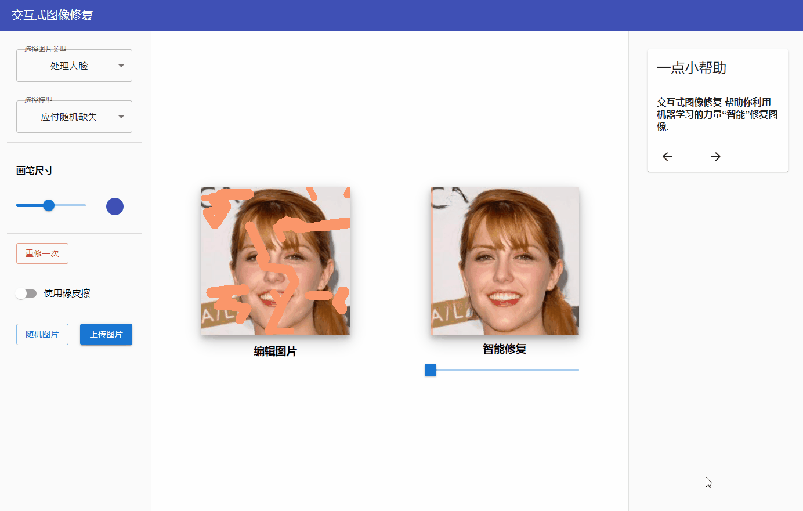
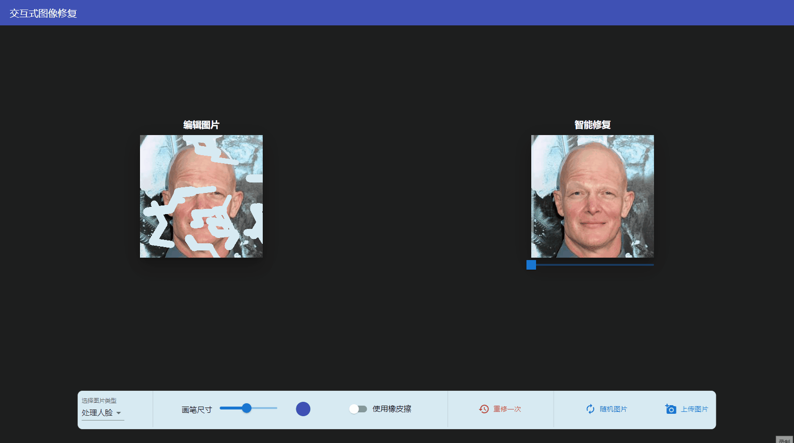
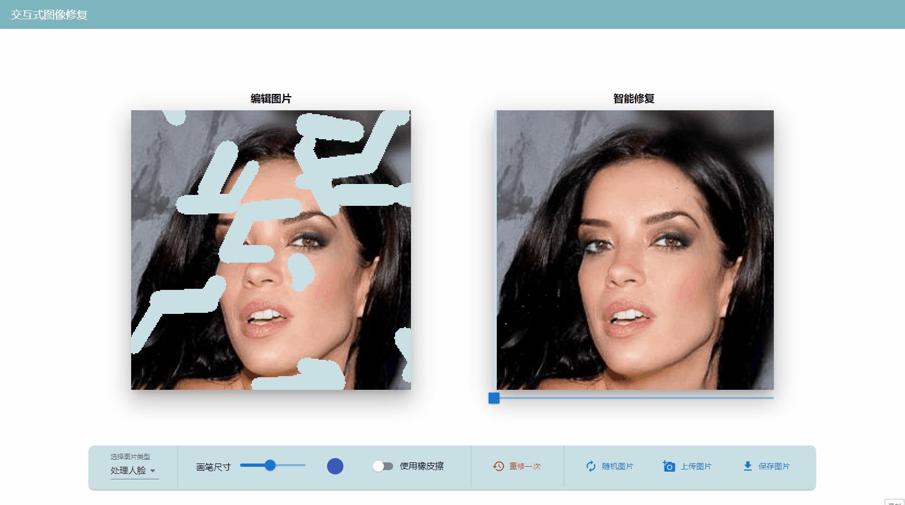

本项目用于图像修复效果展示，项目大体分为前后端两个部分。

后端是由Python，结合Numpy及Pytorch编写的修复模型。

前端逻辑通过js书写，界面通过React配合MUI组件库设计。

前后端交互通过Flask实现。

#### 功能概览

- [x] 支持人脸/风景处理
- [x] 滑块拖动对比
- [x] 橡皮擦/一键撤销
- [x] 画笔调整
- [x] 上传/下载图片
- [ ] 网页端可访问


#### 运行

在运行之前，我们需要准备模型需要的依赖库及前端所需的组件库。

进入后端项目主目录inpaint，使用conda配置所需要的运行环境，运行如下命令：

```python
conda create  --name pytorch --file spec-list.txt
或者
conda env create -f environment.yml
```

随后运行服务器端程序

```python
python inpaint_server.py
```

在项目主目录安装前端依赖，运行启动命令：

```bash
yarn install
yarn start
```

#### 文件说明

```
├─inpaint ----------------------- // 服务器端
│	├─configs --------------------- // 模型配置文件
│	│	├─celebahq_center.json 
│	│	├─celebahq_gconv.json 
│	│	└─places2_gconv.json 
│	├─datasets -------------------- // 模型数据集
│	│	├─celebahq 
│	│	├─places2 
│	│	└─test 
│	├─environment.yml ------------- // 服务器端环境配置要求
│	├─inpaint_server.py ----------- // 前后端对接逻辑
│	├─model ----------------------- // 模型定义
│	├─release_model --------------- // 预训练模型
│	└─result.png 
├─package-lock.json 
├─package.json ------------------ // 前端依赖
├─public ------------------------ // 公共资源
│	├─index.html 
│	├─logo_buaa.png 
│	├─manifest.json 
│	├─人脸图片.jpg 
│	└─示例图片.jpg 
├─README.md 
└─src --------------------------- // 前端功能及逻辑实现
  ├─App.css --------------------- // 样式文件
  ├─App.js ---------------------- // 主界面
  ├─Help.js --------------------- // 帮助
  ├─Modified.js ----------------- // 图片显示界面
  ├─Options.js ------------------ // 选项栏
  ├─registerServiceWorker.js 
  └─util.js --------------------- // 封装接口
```

#### 版本更新

##### v 0.1



##### v 0.2




##### v 0.3



